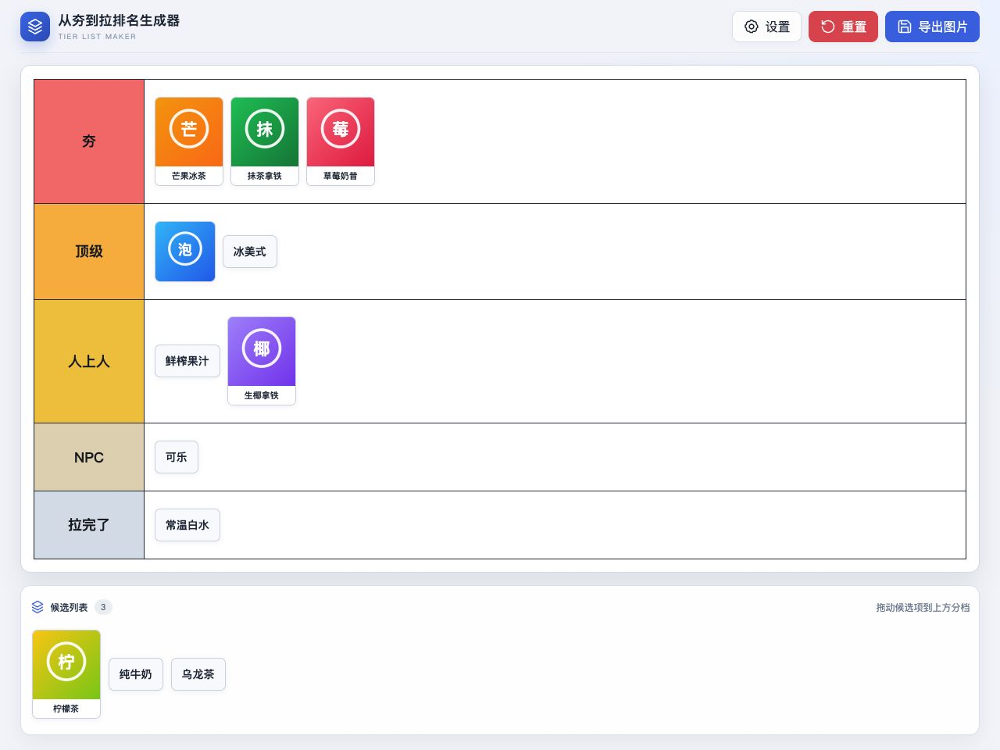

# 从夯到拉排名生成器

一款简单直观的 Windows / macOS 桌面排名工具。添加候选项、拖入不同分档、调整展示样式，然后导出一张完整的排名图片。

适合制作作品排行、角色强度榜、产品对比、赛事点评、直播互动等各种 Tier List。



## 功能特性

- **拖拽完成排名**：候选项可以在候选列表和各个分档之间自由移动。
- **三种候选项样式**：支持纯文本、纯图片以及图片 + 文本。
- **自由配置分档**：可修改分档名称、颜色、数量和顺序，也可直接使用预设模板。
- **灵活管理候选项**：支持批量添加、表格导入、图片导入、编辑、一键去重。
- **自适应展示**：表格会根据窗口和内容自动调整；项目过多时自动换行并扩展页面。
- **个性化外观**：可设置 Logo、标题、字体和图片尺寸，并通过实时预览查看效果。
- **一键导出图片**：将完成的榜单导出为 PNG，便于分享、发布或加入视频素材。
- **本地自动保存**：分档、候选项、排名和外观设置都会保存在本机。

## 界面展示

### 自定义显示效果

标题、Logo、分档文字、标签文字和图片尺寸都可以调整，修改尺寸时可直接查看实时预览。


### 管理候选项

候选项可以逐个创建，也可以批量导入；文本、图片和图文混合内容可以放在同一个榜单中使用。


## 使用方法

1. 在“候选项管理”中添加文本、图片或图文候选项，也可以批量导入。
2. 在“分档/列管理”中设置需要的分档名称、颜色和顺序。
3. 回到主界面，将候选项拖入对应分档，并随时调整位置。
4. 排名完成后选择“导出图片”，保存当前榜单。

## 批量导入

### Excel

支持 `.xlsx` 文件。表格中需要包含一列表头为 `选项名`，该列下的非空内容会导入为纯文本候选项。

### ZIP

ZIP 中需要包含：

- 一个格式同上的 `.xlsx` 文件；
- 一个 `images` 文件夹。

图片文件名（不含扩展名）与选项名一致时，会自动组合成“图片 + 文本”候选项；没有匹配图片的项目会作为纯文本导入。

```text
候选项.zip
├── candidates.xlsx
└── images
    ├── 玩具.png
    └── 水果.webp
```

支持 PNG、JPG/JPEG、GIF、WebP、BMP、AVIF 和 SVG 图片。非方形图片会居中裁切为正方形显示。

## 本地运行

```bash
npm install
npm run dev
```

## 构建桌面应用

```bash
npm run build
npm run dist:mac
npm run dist:win
```

构建产物会输出到 `release/` 目录。

## Credits

This app is designed by human, and completely featured by OpenAI Codex. Codex is sooooooo amazing!

## License

MIT
